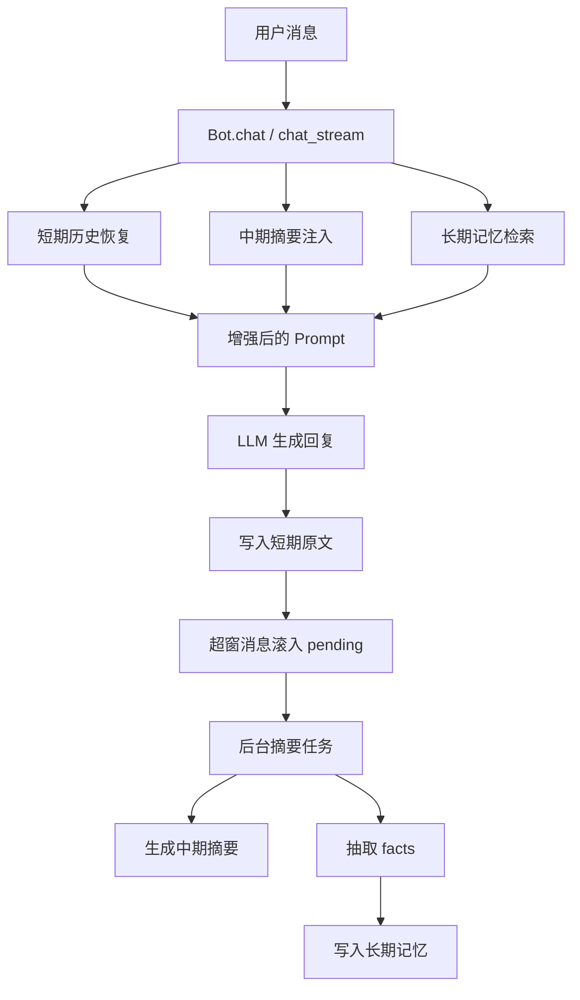
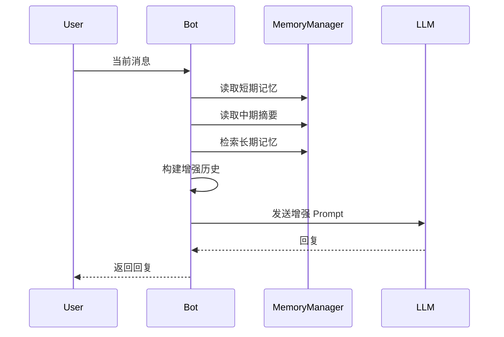
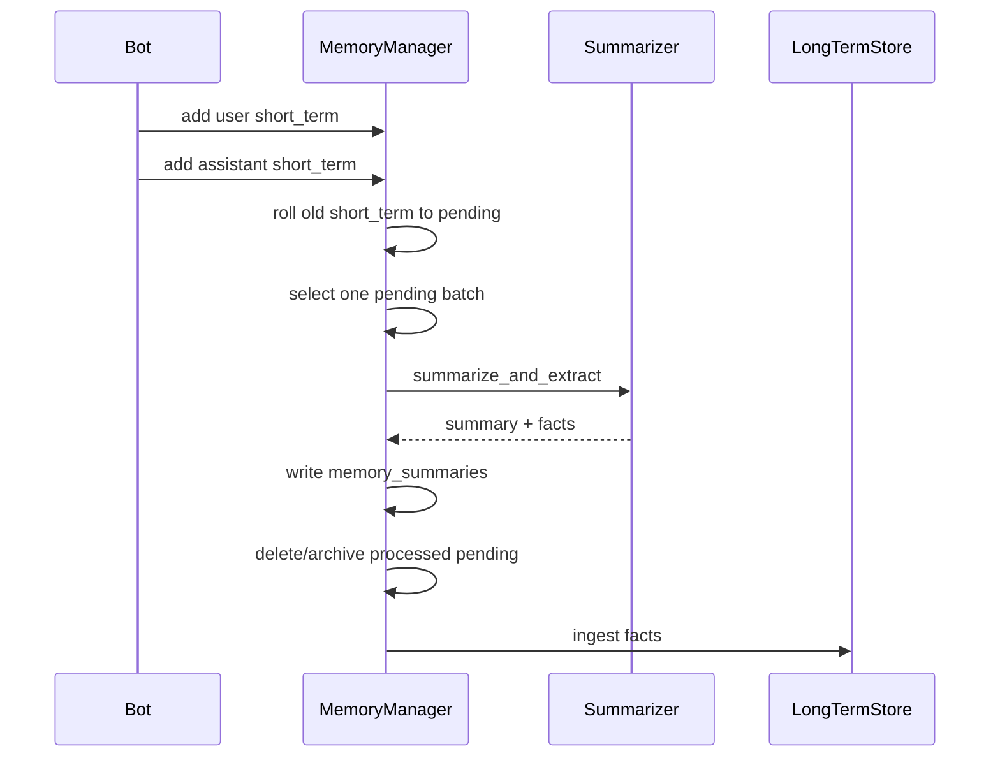
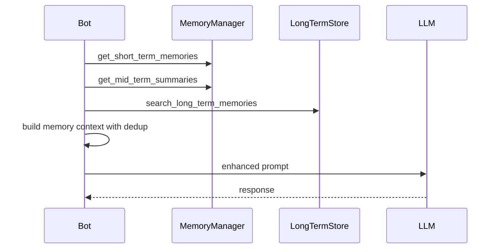

# 记忆系统复刻设计文档

## 1. 文档目标

本文档不是简单复述当前项目源码，而是把当前项目中已经验证可用的记忆系统抽象成一套可在其他项目复刻的设计方案。

目标有三个：

1. 说明当前项目记忆系统到底是怎么工作的。
2. 提炼出真正值得复刻的设计，而不是照搬所有实现细节。
3. 给出一套可以直接落地的新项目实现路线。


## 2. 一句话结论

当前项目使用的不是“单层向量记忆”，而是一套分层记忆流水线：

`短期原文 -> 待处理区 -> LLM摘要/事实抽取 -> 中期摘要 -> 长期记忆检索`

这套设计的核心优势不是“用了 Chroma”或者“用了某个 embedding 模型”，而是：

1. 原文与摘要分层。
2. 摘要与长期事实分层。
3. 写入异步化，不阻塞主对话。
4. 检索时只注入少量相关记忆，并主动去重，降低复读。


## 3. 当前项目中的真实入口

当前项目的主链路入口如下：

- 聊天主流程：`backend/core/bot.py`
- 记忆配置与数据模型：`backend/memory/models.py`
- 记忆基础流水线：`backend/memory/base.py`
- 长期记忆实现：`backend/memory/manager.py`
- 摘要器：`backend/memory/summarizer.py`
- 向量库：`backend/memory/vector_store.py`
- 外部记忆接入：`backend/memory/external_memobase.py`
- 管理 API：`backend/api/memory.py`
- 语音侧记忆包装：`backend/voice_gateway/memory_pipeline.py`

也就是说，当前实现已经把“记忆”抽成一个独立领域，而不是写死在 Bot 内部。


## 4. 架构总览



这个架构的关键点是：

- 读链路依赖短期、中期、长期三层。
- 写链路先保留原文，再异步压缩。
- 长期记忆不是直接从每轮对话硬抽，而是从摘要结果里抽事实。


## 5. 分层设计

### 5.1 短期记忆

职责：

- 保存最近若干轮原始对话。
- 为当前回复提供高保真上下文。
- 服务重启后能恢复最近对话状态。

特点：

- 存储的是原文，不是摘要。
- 每条消息一条记录，包含 `role/content/timestamp`。
- 超出窗口后不立即丢弃，而是转入 pending。

适合保留的内容：

- 最近对话内容
- 当前问答上下文
- 对连续生成非常敏感的细节

不适合长期停留的内容：

- 冗长图片描述
- 富文本标记
- 只在当前轮有意义的噪音内容


### 5.2 待处理区

职责：

- 承接从短期窗口滚出的旧原文。
- 作为摘要任务的输入缓冲层。
- 避免“超出短期窗口就直接丢失信息”。

特点：

- 数据仍然是原文。
- `pending` 和 `pending_processing` 分开，防止并发摘要时重复消费。
- 支持手动强制摘要，适合异常恢复或会话结束时兜底。


### 5.3 中期记忆

职责：

- 保存一段历史对话的压缩摘要。
- 提供跨轮连续性，而不占用太多 prompt。

特点：

- 按 chunk 生成，而不是对整个会话做一个超长总摘要。
- 带 `conversation_range`，方便追踪来源。
- 会控制最大摘要数量，避免无限膨胀。


### 5.4 长期记忆

职责：

- 沉淀用户长期偏好、稳定事实、关系信息、重要事件。
- 为后续检索提供结构化或向量化召回能力。

特点：

- 当前项目默认使用本地向量库。
- 也支持切换到外部记忆系统。
- 长期记忆来源优先是摘要器提取出的事实，而不是原始聊天逐条硬抽。


## 6. 当前项目的数据模型

### 6.1 `memory_items`

统一承载原文消息，通过 `memory_type` 表示其所处阶段。

建议字段：

| 字段 | 类型 | 说明 |
| --- | --- | --- |
| id | int | 主键 |
| user_id | string | 用户 ID |
| session_id | string | 会话 ID |
| content | text | 实际消息 JSON 字符串 |
| memory_type | string | short_term / pending / pending_processing / archived |
| importance | float | 兼容字段，可保留 |
| meta_data | json | message_index、round_index、batch_id 等 |
| created_at | datetime | 创建时间 |
| updated_at | datetime | 更新时间 |

说明：

- `content` 当前项目直接存 JSON 字符串，这样可兼容不同消息结构。
- `meta_data` 用于存游标、批次、自动清理标记等控制信息。


### 6.2 `memory_summaries`

专门存中期摘要。

建议字段：

| 字段 | 类型 | 说明 |
| --- | --- | --- |
| id | int | 主键 |
| user_id | string | 用户 ID |
| session_id | string | 会话 ID |
| summary | text | chunk 摘要 |
| conversation_range | string | 例如 21-40 |
| meta_data | json | source_ids、facts_count、topics 等 |
| created_at | datetime | 创建时间 |


### 6.3 `memory_session_state`

专门存会话游标。

建议字段：

| 字段 | 类型 | 说明 |
| --- | --- | --- |
| id | int | 主键 |
| user_id | string | 用户 ID |
| session_id | string | 会话 ID |
| message_count | int | 已写入消息数 |
| round_count | int | 轮次数，以 user 为一轮起点 |
| created_at | datetime | 创建时间 |
| updated_at | datetime | 更新时间 |

这个表非常值得保留，因为它让“重启恢复”和“批次范围计算”都更稳定。


### 6.4 `reminder_items`

这是项目里的待办/提醒功能，不是记忆系统核心，但和记忆共用数据库层。

如果你只复刻记忆系统，第一版可以不做。


## 7. 读链路设计

当前项目在生成回复前，会做如下处理：



### 7.1 短期历史恢复

短期记忆会在真正对话前从数据库恢复到进程内历史中。

这样做的意义：

- 服务重启后仍能延续最近上下文。
- prompt 中不会丢失最近几轮真实对话。

设计建议：

- 启动时不要把所有会话都恢复。
- 按需恢复某个 `user_id + session_id` 即可。
- 做一次性标记，避免同一会话重复恢复。


### 7.2 中期摘要注入

中期摘要应以 system context 的方式注入，而不是当作普通消息混入历史。

当前项目思路很合理：

- 只注入最近少量摘要，例如 2 条。
- 文案明确告诉模型：
  - 这是摘要
  - 仅在相关时自然参考
  - 不要逐条复述

复刻建议：

- `mid_term_context_count` 默认值可以设为 `2~4`。
- 摘要要按时间正序拼接，让模型更容易理解先后。


### 7.3 长期记忆检索注入

长期记忆不是全量塞入 prompt，而是按当前 query 召回。

当前项目的关键优化是两层去重：

1. 长期记忆自身去重。
2. 与最近对话内容去重，避免把刚说过的话再当记忆塞进去。

这是当前实现里很值得复刻的细节。

推荐规则：

- 最多只注入 2~5 条长期记忆。
- 注入时不要写成问答模板。
- 写成“可参考的关系记忆，仅在相关时自然带一句”这种 system hint。


## 8. 写链路设计

### 8.1 每轮对话落短期原文

每轮对话结束后：

1. 写用户消息到 `short_term`
2. 写助手回复到 `short_term`

建议在存储前统一做消息清洗：

- 去富文本标签
- 去语音/图片 CQ 码
- 压缩过长图片描述
- 限制单条长度

这样可以显著减少记忆污染。


### 8.2 超出窗口滚入 pending

短期窗口应只保留最近 N 轮。

超过 N 轮的最旧消息不应直接删除，而应转入 `pending`。

这样做的好处：

- 聊天主链路保持轻量。
- 历史原文不会立刻丢失。
- 后台可以慢慢消费这些旧内容做摘要。


### 8.3 后台摘要任务

建议只在 assistant 回复完成后触发摘要任务。

原因：

- 一轮对话通常以 `user -> assistant` 完成。
- 如果在 user 发完就摘要，容易出现半轮语义不完整。

基本流程：

1. 从 `pending` 取最旧的一批。
2. 标记为 `pending_processing`。
3. 调用摘要器得到 `summary + facts + topics + open_loops`。
4. 写 `memory_summaries`。
5. 原文删除或转 `archived`。
6. 抽取 facts 进入长期记忆。


### 8.4 强制摘要与异常恢复

这一点非常重要，当前项目也做了：

- 会话结束时，可 `force=True` 强制处理不足一个 chunk 的残留 pending。
- 若中途异常退出，`pending_processing` 可以恢复回 `pending`。

复刻时建议保留：

- `summarize_pending_now(user_id, session_id, force=True)`
- `_recover_pending_processing()`

否则异常中断时，很容易出现“卡死一批 pending 永远不再处理”。


## 9. 摘要器设计

### 9.1 为什么要结构化摘要

如果只让 LLM 输出一段自然语言摘要，会有几个问题：

- 无法稳定抽取长期事实
- 不容易做程序校验
- 不方便后续扩展 tags、evidence、topics

因此当前项目采用严格 JSON 输出，这是正确方向。


### 9.2 建议输出结构

```json
{
  "chunk_summary": "string",
  "facts": [
    {
      "text": "string",
      "importance": 0.0,
      "compression": "keep|light|compress",
      "tags": ["string"],
      "evidence": ["string"]
    }
  ],
  "open_loops": ["string"],
  "topics": ["string"]
}
```

其中：

- `chunk_summary` 给中期记忆用
- `facts` 给长期记忆用
- `open_loops` 后续可做主动提醒或长期追踪
- `topics` 可做运营分析或外部记忆聚类


### 9.3 为什么 facts 要求 evidence

这是整个设计里最值得保留的安全措施之一。

要求 `facts` 必须附上证据，可以降低：

- 模型臆造用户事实
- 偏好误写入长期记忆
- 对话中暧昧表达被错误固化

建议复刻时保留这个规则，而且可以把 evidence 一起写入长期记忆 metadata。


## 10. 长期记忆设计

### 10.1 来源

推荐优先级：

1. 摘要器 facts
2. 手动录入
3. 极少量启发式规则补充

不推荐：

- 每轮对话直接启发式硬抽所有“像事实的话”

因为这会快速污染长期记忆。


### 10.2 入库条件

建议至少满足：

- `importance >= threshold`
- 文本非空
- 有 evidence
- 与现有长期记忆不高度重复

当前项目就是这么做的，只是重复检测主要依赖向量检索结果。


### 10.3 存储方式

建议支持两种后端：

#### 方案 A：本地向量库

适合：

- 单机项目
- 私有部署
- 想快速起步

建议结构：

- Chroma / Qdrant / pgvector 任一都可
- 每条长期记忆至少保存：
  - content
  - user_id
  - importance
  - timestamp
  - source
  - session_id
  - tags
  - evidence

#### 方案 B：外部记忆服务

适合：

- 多服务共享记忆
- 需要画像、事件、上下文 API
- 需要后续演化成独立记忆中心

当前项目已经给了外部化接口抽象，这部分非常适合在大项目里沿用。


## 11. 推荐的配置模型

建议保留以下配置项：

```yaml
memory:
  pipeline_enabled: true
  short_term_enabled: true
  short_term_keep_rounds: 20
  pending_enabled: true
  pending_chunk_rounds: 20
  pending_delete_after_summary: true
  pending_overlap_messages: 4
  mid_term_enabled: true
  mid_term_context_count: 2
  summarizer_enabled: true
  summarizer_max_facts: 20
  summarizer_fact_min_importance: 0.7
  summary_max_length: 500
  max_summaries: 10
  long_term_enabled: true
  long_term_strategy: local
  rag_top_k: 3
  rag_score_threshold: 0.72
  max_long_term_memories: 1000
  embedding_provider: aliyun
  embedding_model: text-embedding-v3
```

建议复刻时不要再保留“双入口配置”。

也就是说：

- 不要同时存在 `llm.memory` 和顶层 `memory`
- 统一只留顶层 `memory`


## 12. 推荐的核心类设计

### 12.1 `MemoryManager`

职责：

- 管理短期/中期/长期读写
- 调度 pending 摘要
- 暴露给 Bot 使用的统一接口

推荐接口：

- `initialize()`
- `add_short_term_memory()`
- `get_short_term_memories()`
- `get_pending_memories()`
- `summarize_pending_now()`
- `get_mid_term_summaries()`
- `add_long_term_memory()`
- `search_long_term_memories()`
- `get_long_term_memories()`
- `get_stats()`


### 12.2 `Summarizer`

职责：

- 输入 chunk 原文
- 输出结构化摘要和 facts

推荐接口：

- `summarize_and_extract(conversations, overlap_tail, max_facts)`


### 12.3 `LongTermStore`

职责：

- 封装长期记忆存储后端
- 屏蔽向量库与外部服务差异

推荐接口：

- `add_memory()`
- `search_memories()`
- `get_user_memories()`
- `delete_memory()`
- `update_memory()`
- `clear_user_memories()`


### 12.4 `BotMemoryAdapter`

职责：

- 把 MemoryManager 接入聊天链路
- 负责 prompt 注入策略
- 负责写前 sanitize

这个适配层最好存在，避免 Bot 直接了解底层太多表结构细节。


## 13. 推荐时序

### 13.1 对话写入时序




### 13.2 对话读取时序




## 14. 可以直接复刻的伪代码

### 14.1 写入短期并触发流水线

```python
async def add_turn(user_id, session_id, user_text, assistant_text):
    await add_short_term(user_id, session_id, role="user", content=sanitize(user_text))
    await add_short_term(user_id, session_id, role="assistant", content=sanitize(assistant_text))

    await roll_short_term_to_pending(user_id, session_id)
    await maybe_schedule_pending_summary(user_id, session_id)
```


### 14.2 滚动窗口到 pending

```python
async def roll_short_term_to_pending(user_id, session_id):
    keep_messages = short_term_keep_rounds * 2
    total = count_short_term(user_id, session_id)
    extra = total - keep_messages
    if extra <= 0:
        return

    oldest_items = fetch_oldest_short_term(user_id, session_id, limit=extra)
    for item in oldest_items:
        item.memory_type = "pending"
    commit()
```


### 14.3 摘要并入长期记忆

```python
async def summarize_pending_batch(user_id, session_id, force=False):
    batch = fetch_pending_batch(user_id, session_id, force=force)
    if not batch:
        return

    mark_pending_processing(batch)
    summary, facts, meta = await summarizer.summarize_and_extract(batch)
    write_mid_term_summary(user_id, session_id, summary, meta)
    cleanup_batch(batch)
    await ingest_facts(user_id, session_id, facts)
```


### 14.4 构建 prompt 记忆上下文

```python
async def build_prompt(user_id, session_id, query):
    history = await get_short_term_memories(user_id, session_id)
    summaries = await get_mid_term_summaries(user_id, session_id, limit=2)
    memories = await search_long_term_memories(user_id, query, top_k=3)
    memories = dedup_against_recent_history(memories, history)

    return compose_prompt(
        system_prompt=system_prompt,
        history=history,
        mid_term=summaries,
        long_term=memories,
        current_query=query,
    )
```


## 15. 最小可行复刻方案

如果你想在新项目快速落地，建议按以下阶段来。

### 阶段 1：最小可用版

只做：

- `memory_items`
- `memory_summaries`
- `memory_session_state`
- 短期写入
- pending 滚动
- 手动摘要接口
- 中期摘要注入

先不要做：

- 长期向量检索
- 外部记忆系统
- 语音链路复用

这样你能先把“短期不爆炸、历史能压缩”这件事做稳。


### 阶段 2：长期记忆版

新增：

- 向量库
- facts 抽取
- 长期记忆搜索接口
- prompt 中的长期记忆注入

做到这一步，才算完整复刻当前项目的核心价值。


### 阶段 3：平台化版

新增：

- 外部记忆服务适配层
- 画像/事件/context API
- 运营后台
- 手工编辑长期记忆
- 监控与统计


## 16. 不建议原样照搬的现有问题

### 16.1 缓存失效实现存在缺陷

当前项目缓存 key 是 MD5 后的字符串，但清缓存时又按原始 pattern 去匹配，这会导致按模式清理大概率失效。

复刻时建议：

- 要么直接使用原始 key
- 要么单独维护“tag -> cache keys”映射
- 不要对哈希值做字符串 pattern 删除


### 16.2 旧版启发式长期抽取逻辑不要复刻

当前项目旧逻辑已经弱化，且接口与当前向量库封装不完全一致。

建议：

- 第一版直接禁用 legacy auto extract
- 长期记忆只走结构化 facts


### 16.3 配置兼容层不要长期保留

当前项目为了兼容历史版本，同时支持 `llm.memory` 和顶层 `memory`。

新项目里不需要继承这个包袱。


### 16.4 不要把“记忆管理器初始化”写死在所有入口里

当前项目的惰性初始化思路是对的，但如果项目继续扩展，建议把初始化统一放到应用生命周期管理里，而不是由每个调用点反复判断。


## 17. 推荐你在新项目直接保留的接口

建议最少保留这些 API：

- `GET /memory/stats`
- `GET /memory/short-term`
- `GET /memory/pending`
- `POST /memory/pending/summarize`
- `GET /memory/mid-term`
- `GET /memory/long-term`
- `POST /memory/long-term/search`
- `POST /memory/long-term`
- `POST /memory/clear`

这样后续做调试和运营会轻松很多。


## 18. 复刻时的推荐技术选型

### 小型项目

- DB：SQLite / PostgreSQL
- 长期记忆：Chroma
- 摘要器：复用主 LLM，单独设低温度
- 任务执行：直接 asyncio 后台任务

### 中型项目

- DB：PostgreSQL
- 长期记忆：Qdrant / pgvector
- 摘要器：专用模型或专用 provider
- 任务执行：Celery / RQ / 自建 worker

### 大型项目

- DB：PostgreSQL
- 长期记忆：外部记忆中心服务
- 摘要器：专用服务
- 事件流：Kafka / Redis Stream
- 统一 observability 与后台管理


## 19. 最值得复刻的 10 条经验

1. 先存原文，再异步压缩，不要同步摘要。
2. 用 pending 作为缓冲层，不要超窗就直接删除。
3. 用 chunk summary 而不是全会话大摘要。
4. 长期记忆优先来源于结构化 facts。
5. facts 必须带 evidence。
6. 长期记忆注入时必须和近期对话去重。
7. 记忆写入前必须做 sanitize。
8. 用 `session_state` 保存轮次和消息游标。
9. 给记忆系统单独提供 API 和管理能力。
10. 存储后端要可替换，业务层不要写死在某个向量库上。


## 20. 最终建议

如果你要在别的项目复刻，不建议直接复制当前项目全部代码；更好的做法是：

1. 复刻它的分层思想。
2. 复刻它的写入时序。
3. 复刻它的结构化摘要输出。
4. 复刻它的长期记忆去重注入策略。
5. 修掉当前实现里的缓存与兼容包袱。

最稳的落地顺序是：

`短期窗口 -> pending -> 中期摘要 -> 长期 facts -> RAG 注入`

不要一开始就上太多“智能判断”，先把这条主链路做稳，效果通常已经会很好。

